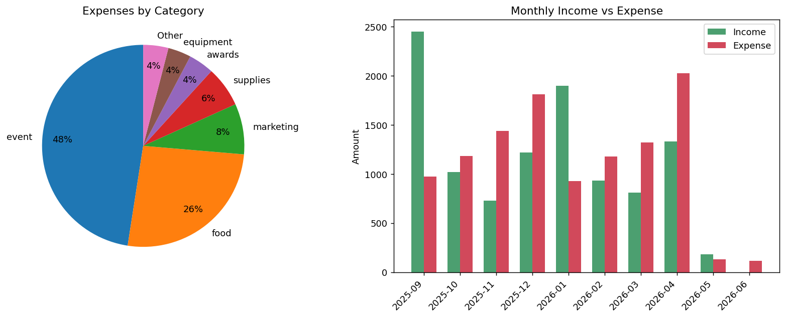

# Club Budget Tracker

동아리 재무를 관리하는 Python 도구입니다. 거래내역 CSV를 입력하면
수입·지출 정리, 잔액 계산, 카테고리/월별 집계, 예산 대비 실적 비교,
시각화 차트, 그리고 PDF 보고서까지 자동으로 만들어 줍니다.

## 활용
Arc Operation Team의 회계를 담당하며, 매 학기 회비·지원금 수입과
행사·식비 지출을 한 곳에서 추적하고, 임원진이 예산 집행 현황을
한눈에 볼 수 있도록 만들었습니다.

## 기능
- **수입/지출 정리**: 거래를 type별로 분류해 총 수입·지출·잔액 계산
- **카테고리별 집계**: 어디에 돈을 많이 썼는지 큰 순서대로 정렬
- **월별 현금흐름**: 매달 수입·지출·순현금흐름(net) 표로 정리
- **예산 대비 실적**: 카테고리별 예산과 실제 지출 비교 (집행률 %)
- **시각화**: 지출 구성 파이차트 + 월별 수입/지출 막대차트 (`budget_report.png`)
- **PDF 보고서**: 요약 수치 + 예산표 + 차트를 A4 한 장으로 출력 (`budget_report.pdf`)
- **보고서 출력**: 콘솔에 재무 요약 보고서 자동 출력

## 사용법
```bash
pip install pandas matplotlib
python budget_tracker.py sample_transactions.csv
```
실행하면 콘솔 보고서가 출력되고, 같은 폴더에 `budget_report.png`와
`budget_report.pdf`가 생성됩니다.

## 입력 데이터 형식 (CSV)
직접 사용할 때는 `budget_template.csv`를 열어 그 아래에
거래를 한 줄씩 추가하면 됩니다.

| 칸 | 설명 | 규칙 |
|------|------|------|
| date | 거래 날짜 | `2026-09-10` 형식 (연-월-일) |
| type | 수입/지출 구분 | `income` 또는 `expense` 둘 중 하나 |
| category | 항목 | 자유롭게 지정 (단, 같은 종류는 같은 철자로 일관되게) |
| amount | 금액 | 숫자만 (콤마·통화기호 없이) |
| description | 설명 | 자유 |

**category 예시**
- 수입: `membership_fee`, `school_grant`, `sponsorship`, `event_revenue`, `fundraising`
- 지출: `event`, `food`, `marketing`, `supplies`, `equipment`, `printing`, `transport`, `software`, `awards`

> 예산 대비 실적 표에는 `budget_tracker.py`의 `budgets` 딕셔너리에
> 적어둔 카테고리만 표시됩니다. 실제 예산에 맞게 수정해서 쓰세요.

## 출력 예시
```
        CLUB FINANCIAL REPORT
================================================
Total Income :     10,570
Total Expense:     11,106
Balance      :       -536
------------------------------------------------
Expenses by Category:
  event               5,280  (47.5%)
  food                2,900  (26.1%)
  ...
```



## 구조
```
budget_tracker.py          # 메인 스크립트
sample_transactions.csv    # 1년치 샘플 거래내역 (데모용)
budget_template.csv        # 직접 입력용 빈 템플릿
README.md
budget_report.png          # 실행 시 생성되는 차트
budget_report.pdf          # 실행 시 생성되는 PDF 보고서
```

## 기술
- **pandas** — `groupby`, `pivot_table`로 카테고리·월별 집계
- **matplotlib** — 차트 시각화 및 별도 라이브러리 없이 PDF 보고서 생성

## 확장 아이디어
- 분기별 보고서, 회원별 회비 납부 현황 추적
- Google Sheets 연동으로 실시간 입력
- 예산 초과 시 자동 알림

## License
© 2026 Minki Kim. All rights reserved.